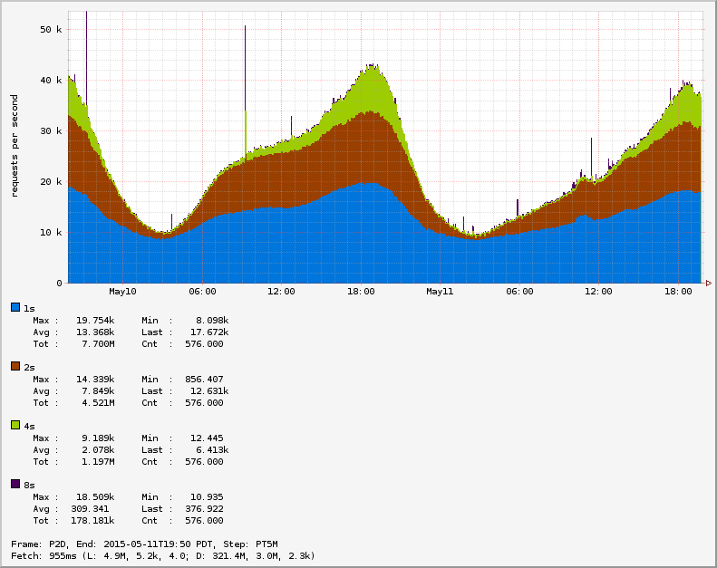
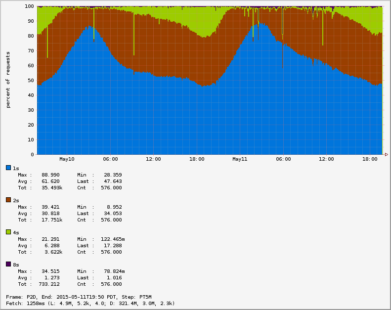
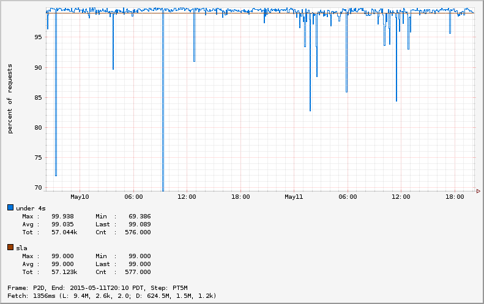

# Bucket Meters: BucketCounter, BucketTimer, BucketDistSummary

The bucket meters allow you to get an idea of distribution related to known SLA.

As an example let's consider an application that has a graph endpoint that should
gather data from multiple sources, aggregate the data, and then present the results
to the user. We have an SLA that specifies that requests should take under 4 seconds.
We create a bucketTimer to track these requests, and consider anything taking
over 8 seconds as too slow:

```js
function Demo(atlas) {
  this.graphTimer = atlas.bucketTimer('demo.graphTime',
    { function: 'latency', value: 8, unit: 's' });
  // ...
}

Demo.prototype.graph = function (req) {
  const start = process.hrtime();
  doIt(function (err) {
    if (!err) {
      this.graphTimer.record(process.hrtime(start));
    }
  });
};

```







## Pros
* Track whether the distribution is approaching SLA
* Easily visualize distribution with RPS
* Relatively cheap

## Cons
* Need to configure it up front
* Change how users think about the problem

## Bucket Functions

### Age

```js
{ function: 'age', value: 1, unit: 's' }
```

### AgeBiasOld

```js
{ function: 'ageBiasOld', value: 1, unit: 's' }
```

### Latency

```js
{ function: 'latency', value: 1, unit: 's' }
```

### LatencyBiasOld

```js
{ function: 'latencyBiasOld', value: 1, unit: 's' }
```
### Bytes

```js
{ function: 'bytes', value: 1048576 }
```

### Decimal

```js
{ function: 'decimal', value: 1000 }
```
