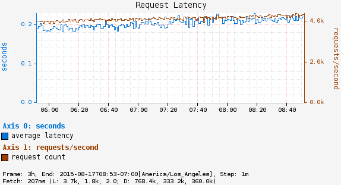
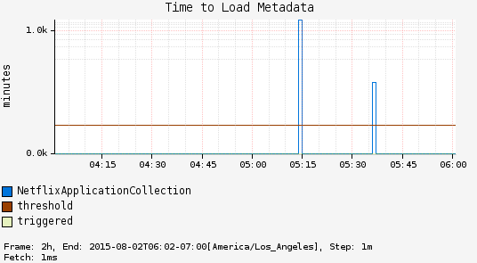

# Timers

A timer is used to measure how long some event is taking. Two types of timers
are supported:

* `Timer`: for frequent short duration events.
* `LongTaskTimer`: for long running tasks.

The long duration timer is setup so that you can track the time while an
event being measured is still running. A regular timer just records the
duration and has no information until the task is complete.

As an example, consider a chart showing request latency to a typical web
server. The expectation is many short requests so the timer will be getting
updated many times per second.



Now consider a background process to refresh metadata from a data store. For
example, Edda caches AWS resources such as instances, volumes, auto-scaling
groups etc. Normally all data can be refreshed in a few minutes. If the AWS
services are having problems it can take much longer. A long duration timer
can be used to track the overall time for refreshing the metadata.

The charts below show max latency for the refresh using a regular timer and
a long task timer. Regular timer, note that the y-axis is using a logarithmic
scale:



Long task timer:


## Timer

To get started create an instance of a timer:

```js
function Server(atlas) {
  this.requestLatency = atlas.timer('server.requestLatency');
}
```

Then measure how long a short task takes. You can use the `timeAsync` helper
to do this. Simply invoke the callback when your task is done.

```js
Server.prototype.handle = function (request) {
  this.timer.timeAsync( (done) => {
    this.handleImpl(request, (err, value) => {
      if (!err) {
        done();
      }
    });
  }
};
```

Additionally there's a `time` helper for synchronous measurements, or you can
explicitly call the `record` method. It takes an array (or two arguments)
similar to what's returned by `process.hrtime()`: seconds, nanoseconds

```js

Server.prototype.example = function (request) {
  const start = process.hrtime();
  ///...

  const elapsed = process.hrtime(start);
  this.timer.record(elapsed);
};
```

## LongTaskTimer

First create an instance:

```js
function MetadataService(atlas) {
  this.metadataRefresh = atlas.longTaskTimer('metadata.refreshDuration');
  // setup async process to call refresh()
}

MetadataService.prototype.refresh = function () {
  const id = this.metadataRefresh.start();
  this.refreshImpl(() => { this.metadataRefresh.stop(id) });
};
```

The `id` is used to keep track
of a particular task being measured by the timer.
It must be stopped using the provided id. Note that unlike a regular timer
that does not do anything until the final duration is recorded, a long duration
timer will report as two gauges:

* `duration`: total duration spent within all currently running tasks.
* `activeTasks`: number of currently running tasks.

This means that you can see what is happening while the task is running, but
you need to keep in mind:

* The id is fixed before the task begins. There is no way to change tags based
  on the run, e.g., update a different timer if an exception is thrown.
* Being a gauge it is inappropriate for short tasks. In particular, gauges are
  sampled and if it is not sampled during the execution or the sampling period
  is a significant subset of the expected duration, then the duration value
  will not be meaningful.
